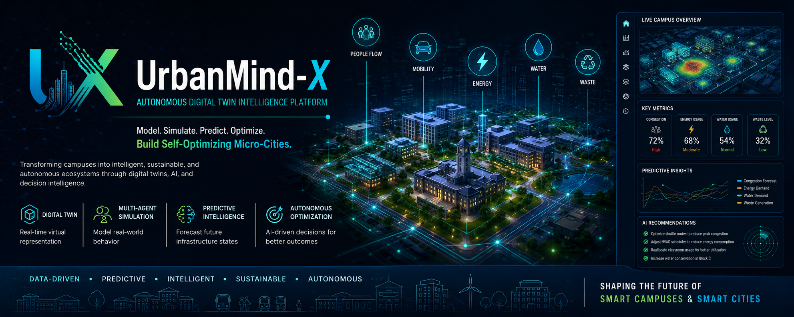

  

# UrbanMind-X

### Autonomous Digital Twin Intelligence Platform for Campus Micro-Cities

UrbanMind-X is an AI-powered digital twin platform designed to transform campuses into intelligent, self-optimizing micro-cities through simulation, predictive analytics, and autonomous decision intelligence.

The platform creates virtual representations of infrastructure systems, population movement, utilities, and resource consumption to enable predictive planning, optimization, and infrastructure resilience.

---

## Project Status

🚧 Research & Architecture Phase

UrbanMind-X is currently under active research and system design.

This repository serves as the public documentation hub for the project's architecture, digital twin framework, optimization engine, and future development roadmap.

---

## The Challenge

Modern campuses function as complex micro-cities consisting of interconnected systems:

- Mobility Networks
- Energy Infrastructure
- Water Systems
- Waste Management
- Space Utilization

However, most systems operate independently and rely on reactive management approaches.

This results in:

- Infrastructure inefficiencies
- Resource waste
- Congestion
- Underutilized facilities
- Poor forecasting capabilities
- Limited decision intelligence

---

## Our Vision

UrbanMind-X aims to shift infrastructure management from:

Reactive Monitoring

↓

Predictive Intelligence

↓

Autonomous Optimization

↓

Self-Optimizing Infrastructure

The goal is to create intelligent environments capable of continuously improving efficiency, sustainability, and operational performance.

---

## Core Capabilities

### Digital Twin Intelligence

Virtual representation of infrastructure systems and operational behavior.

### Multi-Agent Simulation

Simulation of:

- Students
- Vehicles
- Buildings
- Utilities

to model real-world dynamics.

### Predictive Analytics

Forecast:

- Congestion
- Energy Demand
- Resource Consumption
- Infrastructure Stress

### Infrastructure Optimization

Generate AI-driven recommendations to improve:

- Mobility
- Energy Efficiency
- Space Utilization
- Resource Allocation

### Scenario Simulation

Evaluate future events before deployment.

Examples:

- Heavy Rainfall
- Festivals
- Emergency Situations
- Peak Academic Hours

---

## System Architecture

### Input Layer

- Infrastructure Data
- Academic Schedules
- Event Data
- Environmental Data
- IoT & Sensor Data

### Digital Twin Layer

- Infrastructure Modeling
- Spatial Intelligence
- Resource Representation

### Simulation Layer

- Student Agents
- Vehicle Agents
- Building Agents
- Utility Agents

### Predictive Intelligence Layer

- Congestion Forecasting
- Energy Forecasting
- Resource Demand Prediction

### Optimization Layer

- Multi-Objective Optimization
- Policy Evaluation
- Decision Intelligence

### Visualization Layer

- Interactive Dashboards
- Heatmaps
- KPI Monitoring
- Optimization Controls

---

## Documentation

| Document | Description |
|-----------|------------|
| vision.md | Project vision and mission |
| architecture.md | System architecture |
| digital-twin-model.md | Digital twin framework |
| optimization-engine.md | Autonomous optimization engine |
| roadmap.md | Development roadmap |
| technology-stack.md | Technical architecture |

---

## Key Research Areas

- Smart Cities
- Digital Twins
- Urban Informatics
- Multi-Agent Systems
- Infrastructure Intelligence
- Sustainability Engineering
- Predictive Analytics
- Decision Intelligence

---

## Technology Stack

### Frontend

- React.js
- Mapbox GL
- Chart.js
- Recharts

### Backend

- Python
- FastAPI

### Digital Twin Layer

- NetworkX
- Custom Twin Engine

### AI & Analytics

- PyTorch
- TensorFlow
- Scikit-Learn

### Optimization

- NumPy
- SciPy

### Database

- PostgreSQL

### Infrastructure

- Docker
- AWS
- Azure
- Google Cloud

---

## Development Roadmap

### Phase 1

Digital Twin Foundation

### Phase 2

Infrastructure Modeling Engine

### Phase 3

Multi-Agent Simulation

### Phase 4

Predictive Intelligence

### Phase 5

Optimization Engine

### Phase 6

Scenario Simulation Platform

### Phase 7

Autonomous Infrastructure Intelligence

### Phase 8

Smart City Expansion

---

## Future Applications

UrbanMind-X is designed for:

- Universities
- Smart Campuses
- Industrial Parks
- Research Parks
- Innovation Districts
- Smart Cities

---

## Long-Term Vision

To establish UrbanMind-X as a scalable digital twin intelligence platform capable of modeling, simulating, predicting, and optimizing complex infrastructure ecosystems from campus scale to city scale.

---

## Author

### Vishwajeet Nande

Founder, Inovexia AI Technologies

Research Interests:

Artificial Intelligence • Smart Cities • Digital Twins • Multi-Agent Systems • Infrastructure Intelligence • Sustainability Engineering

---

## Disclaimer

UrbanMind-X is a research and development initiative.

The architecture described within this repository represents an evolving framework intended for experimentation, simulation, and future deployment in smart campus and urban intelligence environments.
